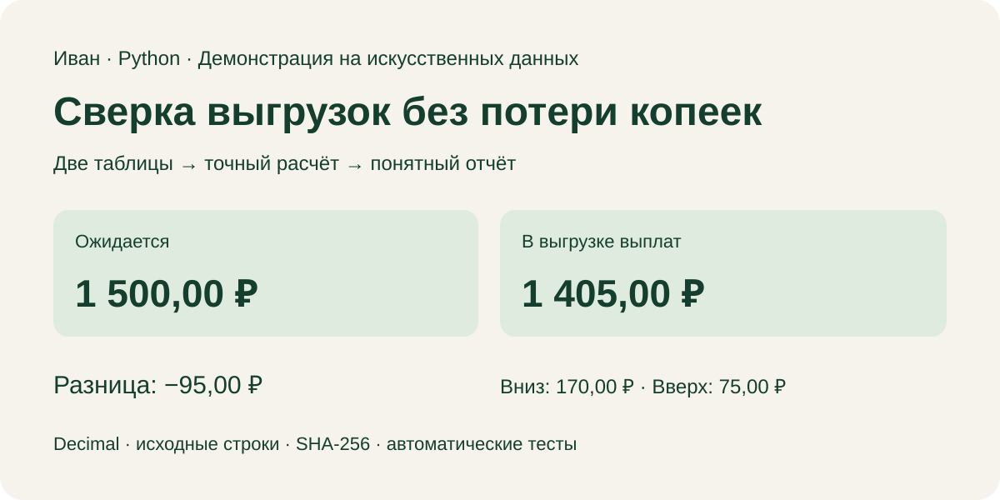

# Сверка CSV-выгрузок на Python

[Открыть демонстрацию в браузере](https://jakesmokie.github.io/csv-reconciliation-demo/)

Две таблицы, один отчёт: какие суммы совпали, где есть расхождения и какие операции отсутствуют в одной из выгрузок.

Я сделал этот пример, чтобы показать, как работаю с данными: сначала понятные правила, затем расчёт, который можно проверить до исходной строки. Все данные здесь искусственные.



**В примере:** ожидается 1 500,00 ₽, в выгрузке выплат — 1 405,00 ₽. Разница составляет −95,00 ₽. Отклонения вниз на 170,00 ₽ и вверх на 75,00 ₽ показаны отдельно, чтобы общий итог не скрывал ошибки.

## Посмотреть результат

- [Готовый JSON-отчёт](docs/report.json): суммы, статусы, исходные значения и номера строк.
- [Правила расчёта и формат файлов](docs/contract.md).
- [Что нужно уточнить для вашего заказа](docs/project-scope.md).

## Запустить локально

Нужен Python 3.10 или новее. Установка пакетов, API-ключи и сервер не требуются. Команды выполняются из папки репозитория:

```bash
python reconcile.py examples/expected.csv examples/actual.csv --out-dir generated
python -m unittest -v test_reconcile
```

Первая команда создаёт `generated/report.json` и `generated/report.csv`. Вторая проверяет расчёты и обработку ошибок. Успешная обработка завершится с кодом `0`, некорректные входные данные — с кодом `2`.

## Что здесь можно проверить

| Что важно в работе с выгрузками | Как это сделано |
|---|---|
| Сохранить копейки | Расчёт через `Decimal`, без `float`; отдельный тест на десятичные дроби |
| Найти пропуски и лишние записи | Четыре статуса: совпадение, расхождение, отсутствующая и неожиданная выплата |
| Объяснить каждую цифру | Исходные значения, номера строк и SHA-256 файлов в отчёте |
| Не подменить ошибку догадкой | Точное сопоставление ID; дубликаты отклоняются с указанием строк |
| Безопаснее открыть отчёт в таблице | Защита текстовых ID от интерпретации как формул; исходный ID сохранён в JSON |
| Проверить суммы другим расчётом | Контрольный набор на 225 ID сверяется с расчётом в целых копейках |

Для автоматической проверки настроен [GitHub Actions workflow](.github/workflows/tests.yml) на Python 3.10, 3.12 и 3.13. Результаты его запусков доступны во вкладке **Actions** репозитория.

## Для реальной задачи

Этот пример рассчитан на два подготовленных CSV одной валюты и согласованного периода. В нём нет подключения к банку или маркетплейсу, расчёта налогов и автоматического объединения нескольких выплат в одну операцию. Допустимо до 100 000 записей на файл; данные читаются в память. При повторном запуске отчёты в выбранной папке заменяются. Подробнее — в [контракте](docs/contract.md).

Для вашего заказа сначала посмотрю примеры выгрузок и согласую правила: по чему сопоставлять строки, как учитывать комиссии и возвраты, что должно попасть в итоговый отчёт. После этого смогу оценить объём, срок и стоимость.

При запуске инструмент записывает в отчёт абсолютные пути к входным файлам. В опубликованном примере они заменены относительными путями. Перед пересылкой собственного отчёта проверьте его данные и пути.

**Иван**
